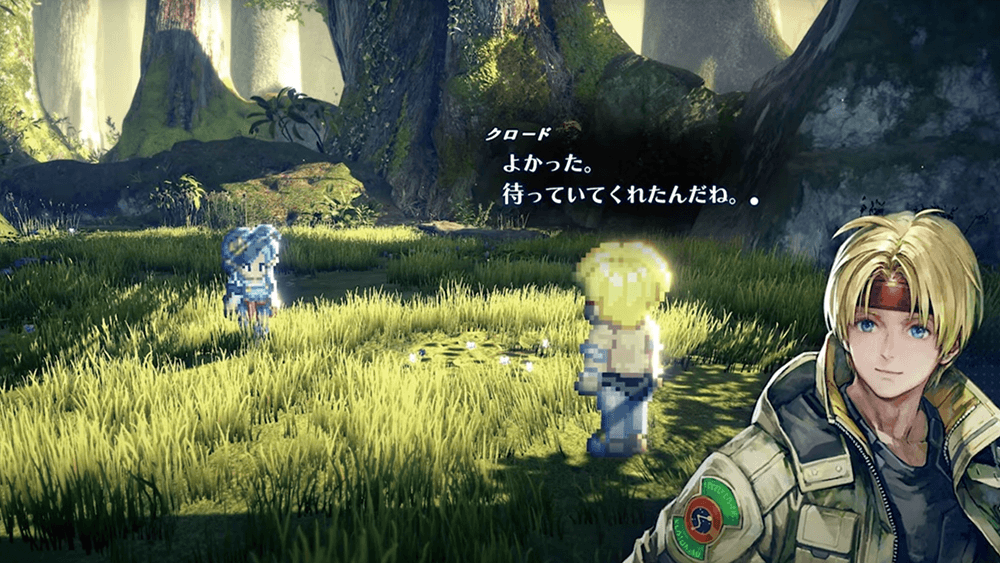
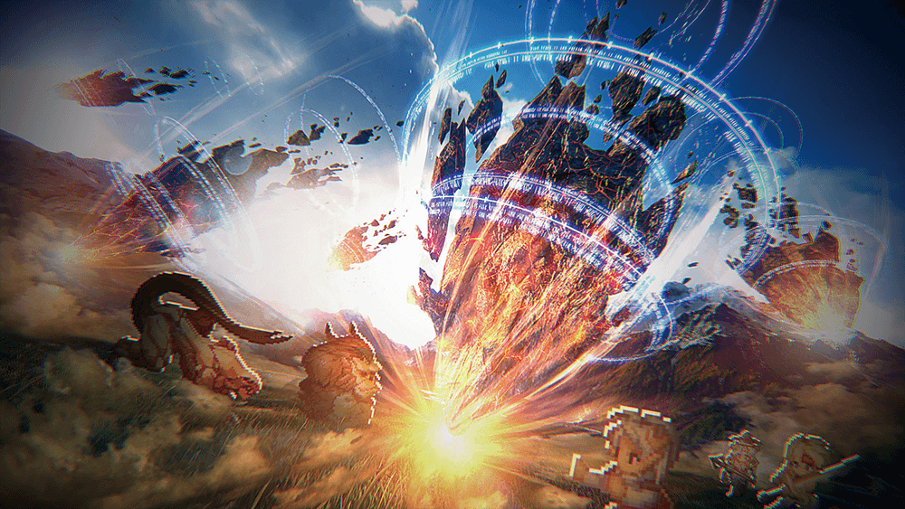
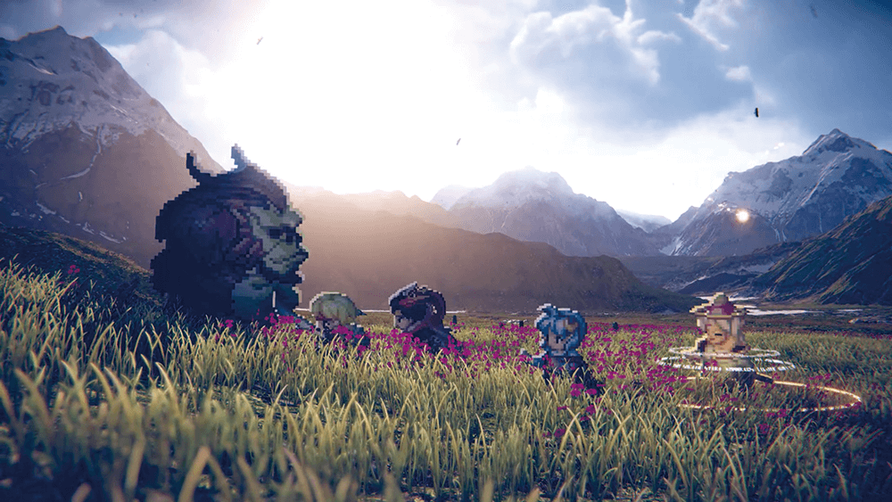
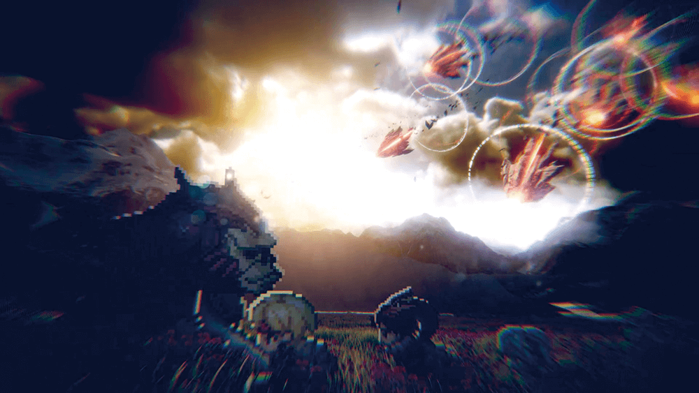
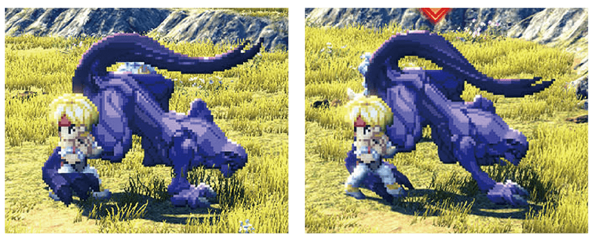
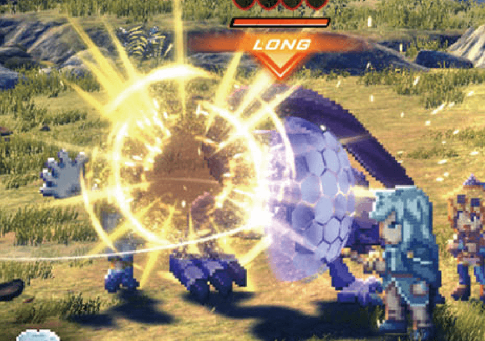
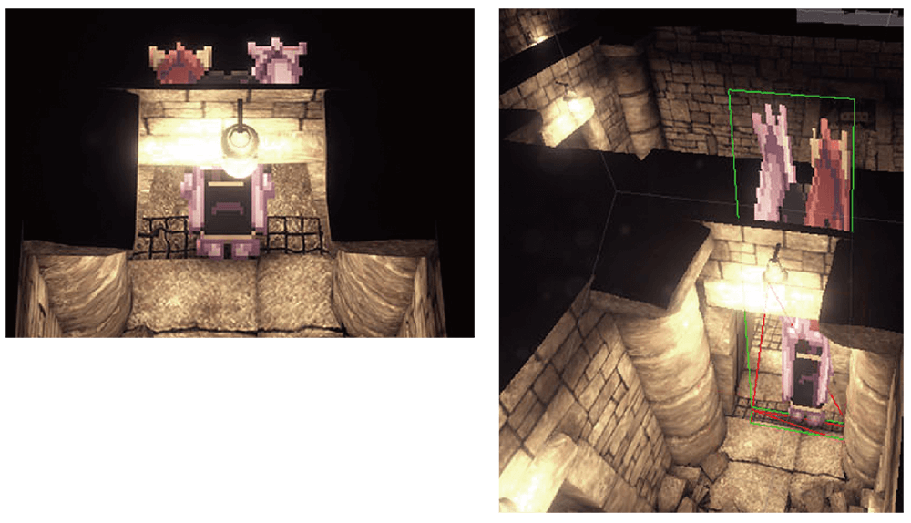
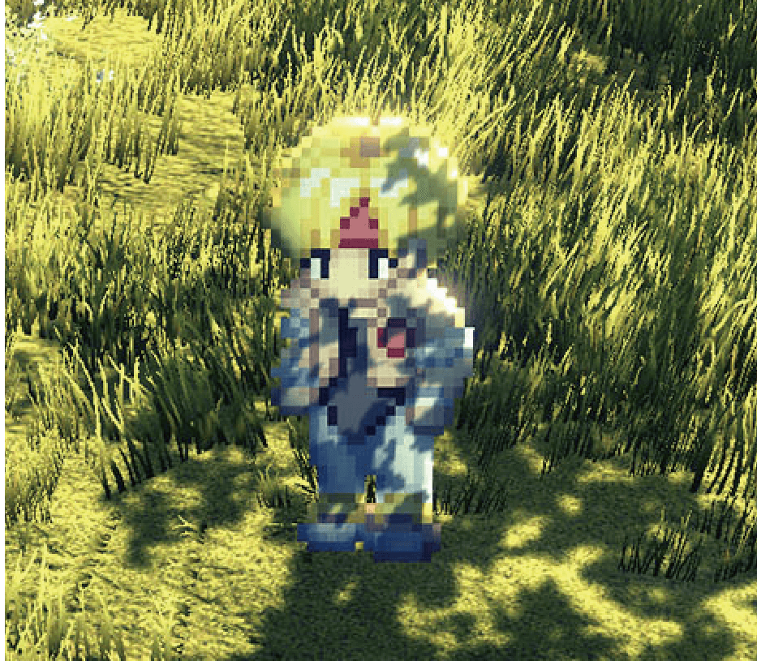
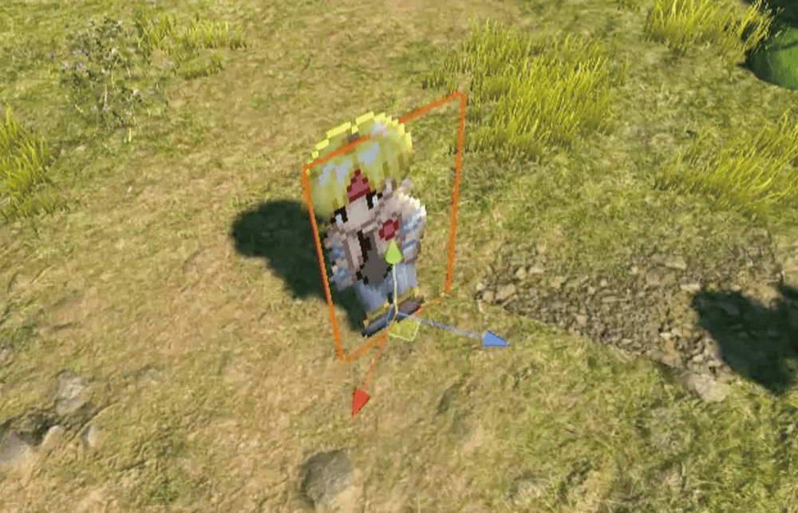
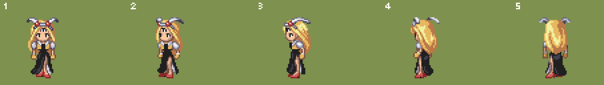

---

title: "【前篇】星之海洋2 The Second Story R 开发者访谈"

description: "https://cgworld.jp/article/202404-so2r-1.html"

date: 2024-04-09

slug: "SO2R-1"

image: "SO2R-1.png" 

categories:
    - "Interview"

tags:
    - "Interview"

weight: 0

---

## 前編：原作のドット絵表現を活かしつつ、3Dによる新たなスタイルを確立

### ファンの思い出と、現在の開発技術を融合させたスタイル
スクウェア・エニックスの小牧 恵氏（プロデューサー）が『SO2R』の開発をジェムドロップの北尾雄一郎氏（ディレクター／開発プロデューサー）に相談した当初、本作はリマスターにする計画だった。「シンプルに画を綺麗にするだけのリマスターであれば、当社でなくてもつくれます。せっかくならリメイクにして、原作である『SO2』を今も愛してくださっているファンの思い出と、現在の開発技術を融合させた新しいスタイルを提案したいと思ったんです」（北尾氏）。

そのビジョンを実現するため、北尾氏は増田幸紀氏（アートディレクター）にスタイルの試作を依頼した。「"リメイクの話をいただいたから、提案用のスタイルの画を何種類かつくってほしい" と聞かされたんです。実はリマスターにする計画だったという話は後になってから知りました（笑）」（増田氏）。

北尾氏の発破を受けて試作された画を見た小牧氏は、方針転換を視野に入れ、社内調整を図ることを決めたと当時の心境をふり返った。「突然良いものが上がってきたので（笑）、"それなら" と頭を切り替えました。当社の『スターオーシャン』シリーズの開発チームは以前から北尾さんとやり取りをしており、北尾さん自身も『スターオーシャン Till the End of Time』（2003）にプログラマーとして参加していたので、シリーズに対する理解が非常に高かったんです。おかげで、すごい早さで話が進みました」（小牧氏）。

とはいえ、原作のドット絵キャラクターと、現在の3D表現が融合した『SO2R』のスタイルが確立するまでには、多くの試行錯誤を要した。「様々な意見が出ましたが、最終的には僕と北尾さんとで、今のスタイルで勝負することを決めました。それが国内外の原作ファンと、新規ユーザーの双方に受け入れられたのは嬉しい成果です。ジェムドロップの技術力と、地道な調整の数々に感謝しています」（小牧氏）。

### 原作のドット絵キャラクターを、現在の3Dに馴染ませる
『SO2R』の開発着手は2021年の初頭で、初期の試作を数名で行なった後、段階的にスタッフを増やしていった。参加したジェムドロップのアーティストは、2Dキャラクターが1名、3D背景が7名、3Dエフェクトが2名、UIが1名で、社外のアーティストも協力している。メインツールはMayaとUnityで、ZBrush、Houdini、SpeedTree、Simplygon、Substance 3D Painter、Substance 3D Designer、Photoshopなども使用した。ドット絵制作ではGraphicsGale、エフェクトの素材制作ではAfter Effectsも使っている。

スクウェア・エニックスの意向もあって、『SO2R』でもキャラクターは原作のドット絵表現を踏襲することが決まっていたが、背景やエフェクトは初期の試作段階で様々なスタイルが提案された。「原作に寄せたスタイル、アニメ風のスタイル、リアルなディテールまで表現したスタイルなどを試作した結果、"リアルが良いですね" という返答をいただきました。その後、Unityで動画も試作して、ドット絵とリアルな3Dの馴染ませ方を提案したんです」（北尾氏）。

#### ジェムドロップによるスタイルの試作

### 思い出の中にあるキャラクターが、リアルな3D世界に舞い降りる
『SO2R』では背景を大胆に変えるからこそ、原作ファンに長く親しまれてきたドット絵キャラクターはなるべく変えないことが重視された。「現在の開発技術があれば、もっと解像度を上げることも、もっと滑らかに動かすことも可能ですが、それをやるとファンの思い出から大きく乖離すると判断しました。だから新規のキャラクターやモーションをつくる場合であっても、3Dに馴染ませる努力はしつつ、クオリティは原作に合わせることにしたんです」（増田氏）。

結果、本作の開発は "ファンの思い出の中にあるドット絵キャラクターが、リアルな3D世界に舞い降りたらどうなるか？" という発想を起点に進められることになったが、ビルボードのキャラクターを3D空間内で破綻なく描画するためには多くの工夫と調整が必要だった。「原作はZソート法でレンダリングしていたので、キャラクターは必ず手前に描画できていたんです。それをZバッファ法で再現しようとした結果、各所で泥臭い調整が必要になりました」（吉川英雄氏・プログラムディレクター）。

#### ドット絵キャラクターを3D空間内で破綻なく描画するための、数多の試行錯誤

#### ドット絵キャラクターを3D背景に馴染ませるための、シェーディングとライティング

#### クロードとオペラの、アイドルモーションの新規制作

Article Copyright / 記事著作権: © 2025 Born Digital, INC. ALL RIGHTS RESERVED.

Game Copyright / ゲーム権利表記: © 1998, 2023 SQUARE ENIX Original version developed by tri-Ace Inc.

Archive Disclaimer: 本ページは、歴史的資料としてアーカイブ保存しているものです。営利目的ではありません。 This article is archived for non-commercial, educational, and preservation purposes only. 本文仅作历史档案保存和学习交流，非商业用途。

Contact: 如有侵权请联系我1599267983@qq.com，我会立即删除。
