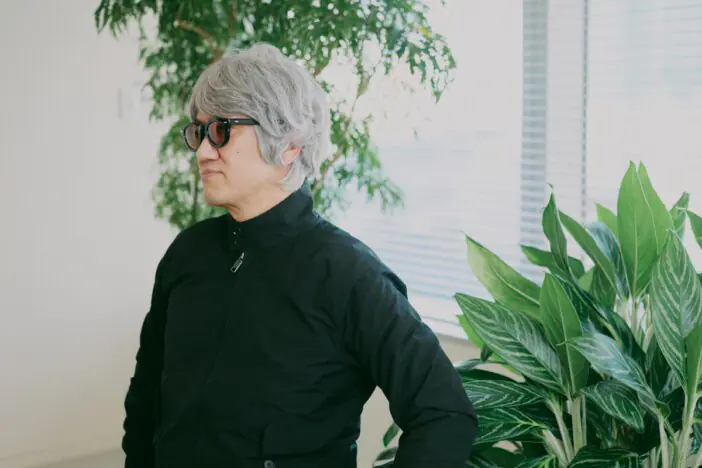
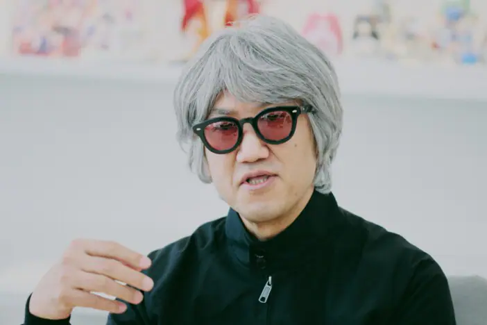

---

title: "在夜晚的新宿亲身经历的真实体验，也是“金子世界”的一部分——“神魔画家”金子一馬所释放的异色根源"

description: "https://realsound.jp/tech/2025/12/post-2216424.html#goog_rewarded"

date: 2025-12-10
slug: "kaneko-1"

image: "kaneko-1.png"

categories:
    - "Interview"

tags:
    - "Interview"

weight: 0

---

## ゲームクリエイターの創作ファイル：第8回

リアルサウンドテックの連載「ゲームクリエイターの創作ファイル」では、“ゲーム作り”にフォーカスしてクリエイターたちにインタビュー。その真髄に迫っていく。

第8回では、「真・女神転生」シリーズや「ペルソナ」シリーズで知られるゲームクリエイター／イラストレーターの金子一馬氏が登場。2023年にコロプラに入社し、生成AIとローグライクカードゲームをかけ合わせた新作タイトル『神魔狩りのツクヨミ』（以下、『神ツク』）のコンセプトプランナーを務めている同氏に、クリエイティビティのルーツから今後の展望に至るまでを伺った。（山本雄太郎）

## 最先端のテクノロジーや流行ジャンルとの出会いを楽しみながら

### ――はじめに、『神ツク』の制作を経て「悪魔絵師」改め「神魔画家」を標榜されることとなった経緯をお聞かせください。

**金子**：「女神転生」シリーズに携わっていた関係で、これまでは「悪魔絵師」として親しみを覚えてくださっていた方も多いと思います。ただ、たとえばインドの方々は自国の神が悪魔として扱われていることに怒っているといった話も耳にしていたので、『神ツク』がいい機会だと思い「神魔画家」を名乗ることにしました。

### ――2025年5月に『神ツク』がリリースされましたが、改めて振り返ってユーザーの反響をどのように受け止めていらっしゃいますか？

**金子**：AIを要素のひとつとして取り入れている点を気に入らないなと思われたり、「金子一馬といえばRPG」というイメージも強いでしょうから、「ローグライクカードゲームは求めていたものと違う」と思われたりすることを心配していたんですが、意外にも多くの方に受け入れていただけた印象です。

AIに関しては、「AIカネコ」としてひとつの人格のような形に仕立て上げたことも、結果としてよかったのかなと思います。

### ――『神ツク』の制作に携わることになった経緯を教えてください。

**金子**：ジャンルも含め「どんなゲームにしようか？」という段階からのスタートだったので、自分としてはRPGを想定しており、それに合わせて世界観設定などもかなり詰め込んでいきました。その後ローグライクカードゲームを作ることが決まったわけですが、自分としても注目していたジャンルだったこともあり、作ったお話や設定をローグライクカードゲームにどう落とし込んでいくかを考えていくのは意外にもおもしろい作業でした。

## 「ツッパっていた」10代の経験が今も活きている

### ――「真・女神転生」シリーズの悪魔デザインなどで知られる金子さんですが、イラストを描くようになったきっかけはどのようなものだったのでしょうか？

**金子**：絵については、子どものころに家があまり裕福ではなく、ひとり遊びするしかなかったから絵ばかり描いていたというのがありますね。

子どもの絵ってどうしても正面から描きがちじゃないですか。その点、自分はなんとなくそのころからパースがついた立体的な絵を描くクセがあったように思います。あと、たとえば「ゴジラがロボットになったらどうなるんだろう？」といった妄想を絵にすることも好きでした。後々、公式に「メカゴジラ」が登場することになり、もちろん自分が妄想で描いたものとは似ても似つかないデザインだったわけですが（笑）。

小学生になると、先生が期待しているものをうっすら察せてしまう子どもだったのもあり、「こういうものにしたら先生がよろこぶかな」なんて張り切って防災ポスターとか図工の作品とかを作ると、先生がコンクールに出してくれて賞をもらえたようなこともけっこうありました。

### ――イラストを仕事にしようと決断するに至るまでには、どのような経緯があったのでしょうか。

**金子**：高校生くらいになると承認欲求が出てくるわけで、だけど自分には自慢できることがないとなると、“ツッパる”方向に走る人もいるわけですよ。自分がまさにそうで、モテたいな、カッコつけたいなといろいろなことをやりました。実はいまもそのころの経験が意外と活きていたりはするんですが……。

まあ20歳を過ぎて学歴もコネもないし就職先をどうしようとなったときに、「そうだ、僕は絵がうまかったじゃないか」と思ったんです。それで当時のバイト求人誌からアニメーター募集に応募して、そこでいろいろ学びました。

有名な会社ではなかったので、下請けの下請けの下請けみたいな仕事が入ってくるんです。たとえば『ハイスクール！奇面組』で、彼らが遊園地に来てジェットコースターで遊んでいるシーンを頼まれて。「大判」という通常より大きな紙に、5～6人乗っているコースターがループしたりしながら勢いよく走っていく場面を描いてくださいと。

当然、「大判」は作画の労力もかかりますし、「タップ」（位置合わせのための穴）もないから全部自分で作るわけなんです。それを100枚くらい描かされて、「ふざけんな！」と（笑）。がんばって「大判」を仕上げても、他のキャラの顔のアップ＋口パクだけのシーンと単価は変わらないですからね。

例えで100枚と言いましたが、そもそも1000枚くらいは描かないとまともな会社員の稼ぎにはなりませんでした。とはいえ会社も僕も切羽詰まっている状態だったので、一生懸命になんでもやるしかないと思って必死にやっていました。

### ――金子さんのイラストのモチーフとしても多く登場する、悪魔や神などの超自然的な存在に興味を持ったきっかけについてはいかがでしょうか？

**金子**：子どものころは怪獣が好きで、その延長線上の存在として妖怪や悪魔の図鑑をよく読んでいたんです。近所の古本屋に行き、片っ端からそういった図鑑を読んで、そのうちSFや哲学系の雑誌にも手を出していくうちに、「神話っておもしろいな」と思うようになりました。

たとえば『デビルマン』って原作の漫画とアニメの展開が全く違うというのは有名な話なんですけど……あのショッキングな漫画版のラストシーンが、まさに聖書の黙示録をなぞっているのに気付いて驚いたこともありました。そういった有名な作家さんもどこかしらで触れていたのでしょうし、自分にとっても「神話」は、新たに何かを生み出すうえでのアイデアの雛形になっているかもしれません。

### ――過去のインタビューにて、「日本の新宿のアスレチック感を、なぜみんなゲームの題材にしないのだろうと考えていた」（※1）といった趣旨のお言葉があったのが印象的でした。そういったアイデアはどのように生まれたのでしょうか？

**金子**：学生時代、新宿の雰囲気にどこか惹かれていて、よく足を運んでいたことがあったんですよ（笑）。80年代当時はバブル期のディスコ全盛時代で、歌舞伎町は毎晩のように独特の熱気に包まれていたんです。

その一方で、警察の巡回が突然入ることもあり、街全体がどこかスリリングでしたね。非常階段を駆け上ったり、思わず別のビルに逃げ込んだりしたこともあって（笑）。

それらの非日常的な空気が印象的で、「女神転生」の世界観にも影響を与えています。あの頃の新宿は、そういった一種の魔境っぽさがあったと感じていたので、ゲームにしたら面白いだろうなと。

## “外側の色付け”を担う者としての矜持

### ――ゲームクリエイターとして心がけていることや、こだわりについて教えてください。

**金子**：ゲームを遊んでくれるお客さんからどう見えるかは常に意識しているので、「お客さんにはこう見えてしまうよね」ということは制作チームのスタッフにもわかってもらう必要があると思っています。意図やこだわりがあるのは理解できるけれど、それをお客さんにきちんと伝えられているのかという部分。

そういったところも含めて、さまざまなスタッフがいるなかで、彼らが当然抱えるであろう疑問をケアしていくのが大事だと思っています。自分も最初から偉かったわけじゃなくて、ヒラの人間として働いてきた経験がありますから。

### ――過去のトークイベントでは、会社員として集団で仕事をするうえで大切なことについても語られていましたね。（※2）

**金子**：だからといって、先輩だから飲みに行って教えてやるぜみたいなことは一切なくて。基本的には出来上がったものに対して、「これはこうだよね」と指摘させてもらうような形です。たとえば背景の動かし方ひとつとっても、すぐ近くのものと遠くにあるものが同じ速さで流れていくように見えるというのは現実ではありえませんよね。

とにかく動かさないと売れないという思考になってしまっている人は意外と多いので、しっかりとした理論に基づいて「不必要なことはやらなくていいんだ」とディレクションできる人がいることは大事かなと思います。ちゃんと絵のことまで理解できている人は、いまのゲーム業界では本当に少なくなってきているのではないでしょうか。

### ――スタッフに対してディレクションするお立場から、思いを齟齬なく伝えるなどで気を使っていることはありますか？

**金子**：ふだん特に意識しているわけではないですけれど、ここまでお話したことを逆説的に考えると、「これは言ったほうがいいかも」と思ったことを飲み込まずに相手に伝えることでしょうか。1対1のディレクションにとどまらず、アイデアや問題の解決策なんかもそうですね。「これは言うべき」と思う事柄は直感的に降ってくる感覚なので、その直感を大切にしています。

### ――そうした直感は、どのようなタイミングで降ってくるものなのでしょう。

**金子**：いつもよりも早起きしちゃったな。じゃあせっかくだから行ったことのない街に行ってみよう。で、たまたま入った本屋でいい本を見つけて、それがヒントになる――みたいなことがありますね。「あのデザインがイマイチなんだよな」と思いながら、もんもんとテレビを見ているうちにひらめくなんてパターンもありますけど。

### ――非常にエネルギッシュかつバイタリティに溢れていて、インプットを常に欠かさず、何よりもそれらの立ち居振る舞いが「ユーザーによろこんでもらいたい」という思いに直結しているのだなと、金子さんのお話を伺っていて感じます。

**金子**：そこが一番大事なのは間違いないです。ただ、よろこんでもらいたいからと要素や機能を何でもかんでも入れるのは違うと思っていて。それよりももっと僕として提供していきたいのは、説得力のあるものなんです。

僕はシナリオに関しても動機づけがしっかりしていないと気になってしまう性格で。たとえば「妹を救うんだ！」というシナリオがあったとして、その理由が「家族だから」では納得できない。なぜ救いたいかが全然説明できていないじゃないかと。

ゲームを遊んでいる方の中にも、僕と同じようにそういう部分が気になってしまう人はたくさんいると思うので、そういった方々にも共感して楽しんでもらえるようなものを作りたいと思っています。

### ――ユーザー目線に立ちながらも単に顔色を伺うのではなく、自分の美学やこだわりに基づいて納得できる形で出力していくことが肝要であると。

**金子**：絵に関しても同じようなこだわりはあると思います。世の中に出回っているゲームを遊んでいるなかで、なぜ顔のスペースの半分以上を目が埋めているような女の子ばかりなんだろうとか、ちゃんと顎を顎として描写していないよなとか、気になってしまうんですよね。

記号化としては優れているけれど、美術を通っている人間からすれば納得いかないし、これだと頭打ちになって海外に負けちゃうんじゃないのかなって思います。

### ――最後に、ゲームクリエイターとしての今後の展望についてお聞かせください。

**金子**：ゲームクリエイターの前にまず会社員なので、ちゃんと仕事を続けられたらいいなと思います。実際問題、ゲームづくりを続けるというのも簡単なことではなくて、というのもいまの時代はゲームが大作化する一方ですから。

RPGであっても、これまでよりもっと壮大なお話、広大なフィールド、美麗なグラフィックが求められるばかりで、声優さんも人気の方がいっぱい出てきますといった方向のインフレになりがちなんですけど、僕としてはそうじゃない気がしていたんです。何かしらの手段でもって異なる表現、斬新な表現を提供していけたらそれがベストかなと考えています。

そういった意味では、今回の『神ツク』のようにAIというテクノロジーをゲームと掛け合わせる方向性を提案してもらい、それに携わらせてもらえたのはすごくありがたい経験だったし、コロプラのような最先端のテクノロジーに強い会社に所属することの代えがたい価値だと感じています。

そういったひとつの解みたいなものを自分で創造できたら一番よかったんですけれども、僕はやはりゲームという出力に対して、“外側の色付け”をやらせてもらっている人間でしかありませんので。

Article Copyright / 記事著作権: © realsound.jp

Game Copyright / ゲーム権利表記: ©COLOPL, Inc.

Archive Disclaimer: 本ページは、歴史的資料としてアーカイブ保存しているものです。営利目的ではありません。 This article is archived for non-commercial, educational, and preservation purposes only. 本文仅作历史档案保存和学习交流，非商业用途。

Contact: 如有侵权请联系我1599267983@qq.com，我会立即删除。