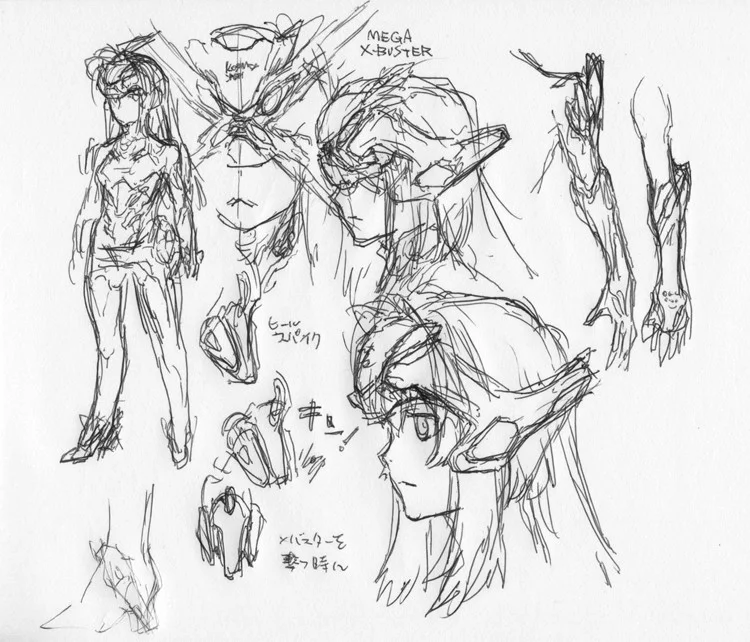
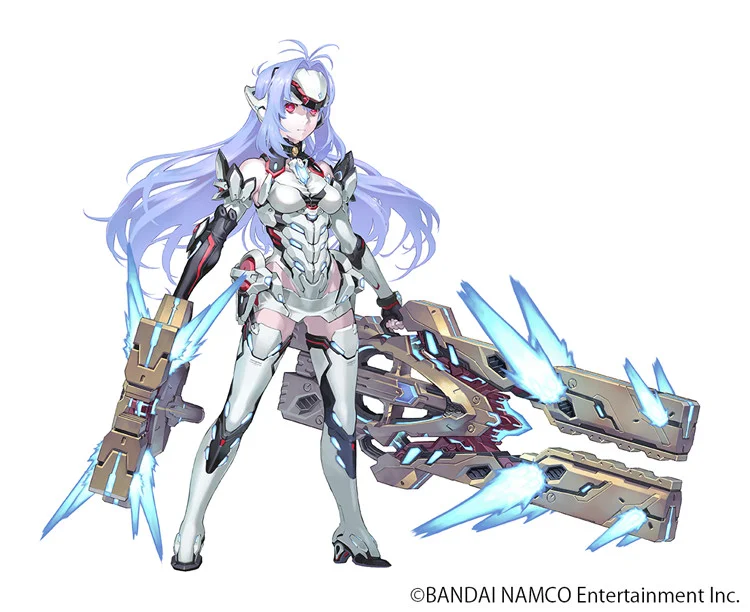

---

title: "創り出すものは受け取ってきたもののリフレイン"

description: "ブレイドデザイン 田中 久仁彦"

date: 2025-12-14

slug: "tanaka-xb2"

image: "KOSMOS-1.png"       

categories:
    - "Interview"

tags:
    - "Interview"

weight: 0

---

こんにちは。レアブレイド「イブキ」「KOS-MOS Re:」のデザインを担当させていただいた田中久仁彦と申します。
またこうして“ゼノ”に携われたことに自分自身驚きましたし、大変嬉しかったです。

初打ち合わせは自分の住む埼玉の某所まで総監督の高橋さんとプロデューサー・ディレクターの小島さんにお越しいただきました。
「今作でKOS-MOS Ver.1を出すことになった。Ver.1なら田中だろう」という切り出しだったと思います。
その言葉に対し自分は、
「これはチャンスなんです」と返しました。

『ゼノサーガ ep１』当初、自分はKOS-MOSのデザインを担当していたのですが、顔立ち、髪型、後頭部までカバーするバイザーというイメージは固まったものの、それ以上が見つからず、かなり悩んでいました。
それまでメカらしいメカをまったくデザインしてこなかったからでした。
そんな時、メカデザインにこういう人に入ってもらった、と高橋さんからイラストを見せてもらいました。
それがCHOCOさんとの出会いでした。
その後、CHOCOさんにKOS-MOSのデザイン担当を代わっていただけるようお願いし、KOS-MOSは自分ではおおよそ浮かぶことのないアイデアによってデザインされ、長く愛されるキャラクターとなりました。
KOS-MOSと『ゼノサーガ』にとって、幸せな結果だったと思います。
（○○はわしが育てた、みたいな言い方になってしまいスミマセン……）

ですが時間が経つにつれ、KOS-MOS Ver.1のデザインをCHOCOさんにやっていただいて良かった、という気持ちと、自分で最後まで頑張ってやってみたかった、という気持ちがぶつかり合うようになっていきました。
そんな経緯があったため今回のお話はとても嬉しく、チャンスとはこういうことなんだ、と実感と理解をしました。

折角なのでシルエットはVer.1のままに、デザインを自分なりに描いてみたい、という申し出にも快く許可をいただけました。
当初妄想したのは「ep1後、Ver.2の筐体になる前の簡易レストア……リペア版」という設定でしたが、デザインを練っていくうちにブレイドは「武器の擬人化（もしくはその逆）」であるべきでは？と思いはじめ、だとしたらこのKOS-MOSは「ゼノサーガの象徴」であるべき、と考えが変わっていきました。

新しくもこれまでを感じさせるようなものになるよう努めていくうち、改めてCHOCOさんの巧さを再確認しました。
X・バスター時に開くのは腹部ではなく、高橋さんのアイデアによりバイザーから発射となりました。

その時、少しギョッとするような物があると、よりKOS-MOSらしいと考え、赤いシールド、そしてオリジナルゾハルのようなモールドが現れるように描きました。
ボディカラーも金の代わりに赤を配色し、エリィのソラリス制服のイメージも持たせようと思いました。
名前の「Re:」については、デザインの過程で意味が変わっていきました。最終的には、CHOCOさんや『ゼノ』シリーズへのレス（返答）と、再度新しく生まれ変わるという気持ちを込めて「KOS-MOS Refrain」と名付けさせていただきました。

これは、プリキュアのようにKOS-MOSを変身させてみたくてデザインしました（笑）。
ドレスのような形状を想像していましたが、このくらいのバランスにして良かったと思います（胸元のリボンのような形状がその名残）。
ゾハル状の武器や、R・キャノン、R・ブレイドもデザインし、やれる限りをやらせていただきました。

イブキに関しては、もう一体デザインしてみたい、ディフォルメのKOS-MOSを出してみたいという、こちらからの発案から生まれたキャラクターでした。
自分の漫画『一撃殺虫!!ホイホイさん』のようなバランスで、それがKOS-MOS Re:と一緒にちょこちょこ付いてきたら可愛いかもと思ったので。
その後、「ターキンと絡ませられる鳥系のキャラクター」という発注がきました。「え？ ウサギでなく？」と正直思いましたが、昔にオカメインコを飼っていたのを思い出し、そのオカメインコをベースに、やはりゴーグルと羽毛の色に『ゼノ』シリーズのモチーフを用いてデザインしました。

今回、デザインをしてみて思ったのは、自分だけの発想では決して産み出せないこと。
そして、発案元へのリスペクトが重要なんだということに気付かされ、反省もしました。
こうしていろいろな物は生まれ変わっていくのだと思います。
『ゼノブレイド２』からもまた、新しいものに継がれていくことを切に願います。

最後に。早く自分のNintendo SwitchにもイブキとKOS-MOS Re:が来てくれますように……（笑）
